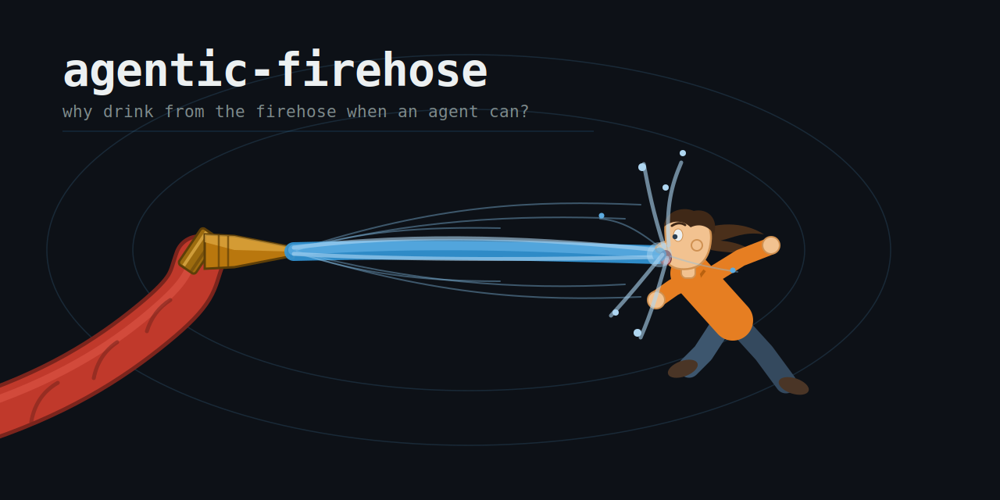

<p align="center">
  
</p>

# agentic-firehose

> Why drink from the firehose when an agent can?

A knowledge base on **agentic engineering** — the design, building, and operation of LLM-based agents. An automated capture agent triages incoming URLs, fetches content, and writes structured captures directly to this repo. Signal gets consolidated into topic notes and synthesised into cross-source essays. Covers Claude Code, harnesses, tool use, memory, evals, cost management, and related practice.

**[→ Live dashboard](https://clewisdev.github.io/agentic-firehose/)**

---

## How it works

```
sources/      Raw captures — one file per URL, written by the Worker
topics/       Distilled knowledge by theme (24 canonical topics)
synthesis/    Cross-source essays: conclusions drawn across 3+ sources
skills/       Claude Code skills used in this KB
worker/       Cloudflare Worker — email-triggered automated capture
```

Sending a URL to the capture address triggers the Worker: it fetches the page, loads the KB conventions from `AGENTS.md`, calls the Anthropic API to triage and summarise the source, then commits a structured capture file directly to `sources/`. Periodically, a synthesis pass cross-links captures into topic indexes and writes synthesis essays.

---

## Fork and run your own

### 1. Clone and set up the repo

```bash
git clone https://github.com/clewisdev/agentic-firehose.git
cd agentic-firehose
```

Edit `AGENTS.md` to reflect your own topic vocabulary, interests, and capture conventions. The 24 canonical topics in the current vocabulary are a starting point — change them to suit what you actually want to track.

### 2. Deploy the Cloudflare Worker

The Worker lives in `worker/`. It requires:

- A Cloudflare account with [Email Routing](https://developers.cloudflare.com/email-routing/) enabled on a domain you control
- An Anthropic API key
- A GitHub fine-grained PAT with **Contents: read+write** on your fork

```bash
cd worker
npm install
```

Edit `wrangler.toml` — set your GitHub username, repo name, and default branch:

```toml
[vars]
GITHUB_OWNER = "your-username"
GITHUB_REPO  = "agentic-firehose"
GITHUB_DEFAULT_BRANCH = "main"
```

Set secrets (never commit these):

```bash
npx wrangler secret put ANTHROPIC_API_KEY
npx wrangler secret put GITHUB_TOKEN
npx wrangler secret put ALLOWED_SENDERS   # comma-separated email addresses allowed to trigger captures
```

Deploy:

```bash
npx wrangler deploy
```

In your Cloudflare dashboard, add an Email Routing rule that forwards your capture address to the Worker.

Smoke-test the pipeline by emailing the capture address with `[test]` in the subject — the Worker commits a healthcheck entry to `sources/skipped/` with no API call.

### 3. Set up the dashboard

The dashboard is a static site in `docs/` rebuilt by a GitHub Action on every push.

Enable GitHub Pages on your fork:
- Go to **Settings → Pages**
- Source: **GitHub Actions**

The dashboard will be live at `https://<your-username>.github.io/agentic-firehose/` after the next push.

To rebuild locally:

```bash
python3 docs/build.py
```

---

## Capturing URLs

Send an email to your capture address with a URL anywhere in the body or subject. Optional subject tags:

| Tag | Effect |
|-----|--------|
| `[test]` | Smoke test — no fetch, no API call, commits a healthcheck entry |
| `[skip]` | Log to `sources/skipped/` without fetching |
| `[brief]` | Force brief capture even if source looks high-signal |
| `[full]` | Force full capture even if source looks low-signal |

Every rejected or skipped item lands in `sources/skipped/` with a one-line reason.

---

## Synthesis

Raw captures (`status: raw`) are cross-linked into topic indexes and synthesised using the `synthesise` skill:

```bash
claude   # open Claude Code in the repo root
# then: /synthesise
```

The skill finds all `status: raw` sources, cross-links them to the relevant topic indexes, checks whether any existing synthesis files need updating, and marks sources as `status: summarized`. It processes in batches of 10 and reports progress so sessions can be handed off cleanly.

The skill file lives at `skills/synthesise/SKILL.md`.

---

## Worker operations

### View live logs

```bash
cd worker && npx wrangler tail
```

Each capture logs: sender, URL, signal level, and committed file path.

### Redeploy after code changes

```bash
cd worker && npx wrangler deploy
```

`AGENTS.md` changes don't require a redeploy — the Worker reads it live from GitHub on every invocation.

### Rotate secrets

```bash
cd worker
npx wrangler secret put ANTHROPIC_API_KEY
npx wrangler secret put GITHUB_TOKEN
```

No redeploy needed — secrets take effect immediately.
